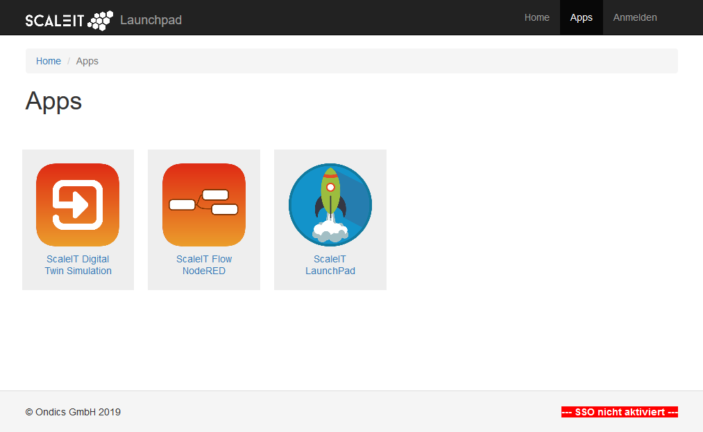
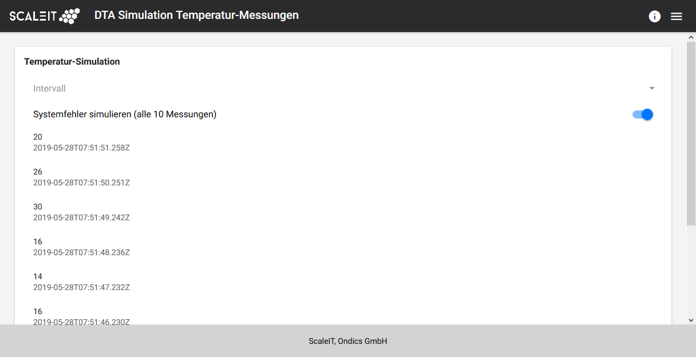
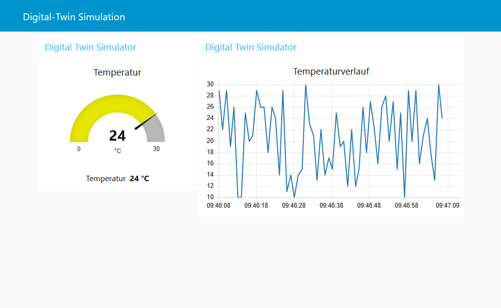
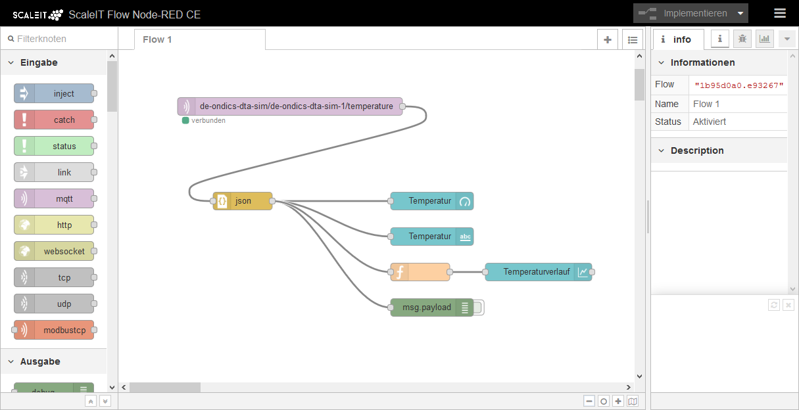
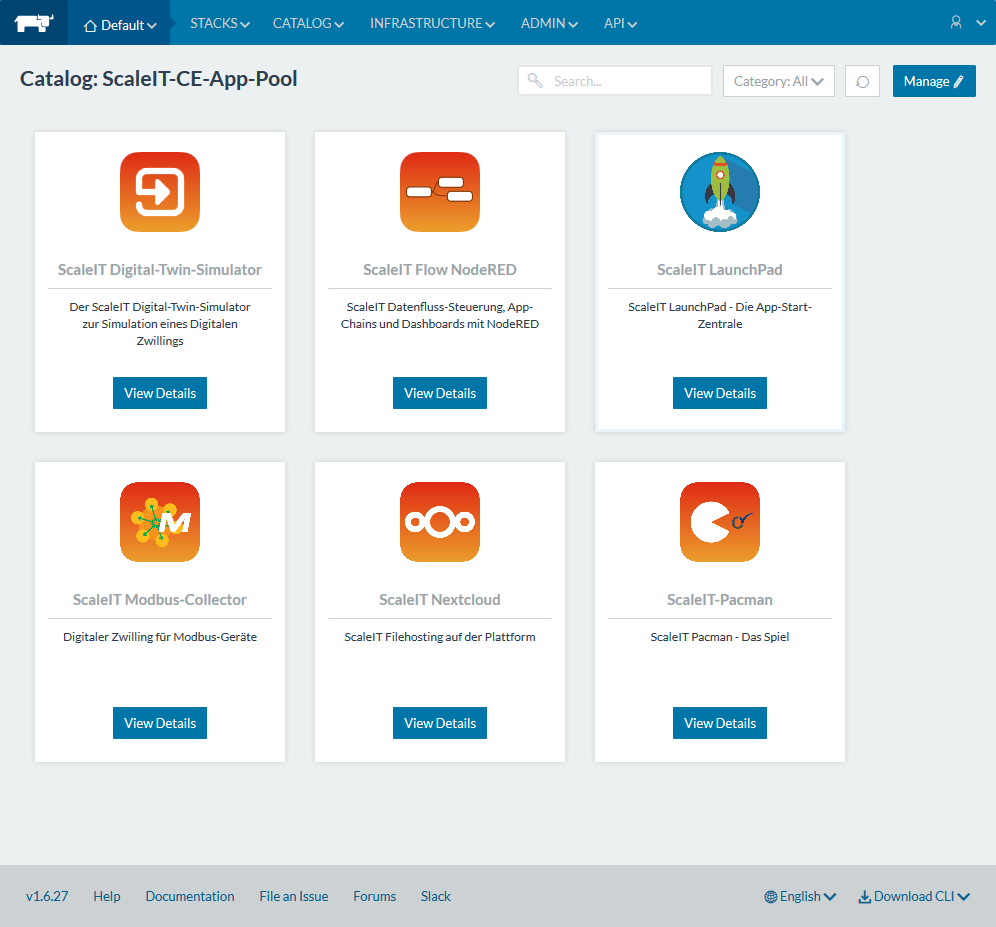
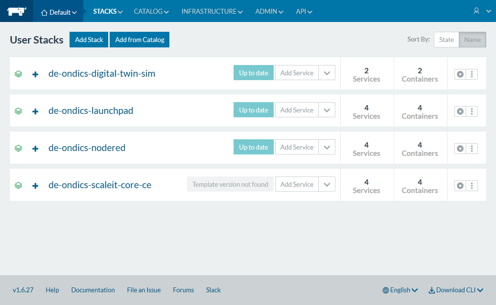

# ScaleIT CE VM

	
	
	
	
	

	
	
	
	

ScaleIT Community Edition Plattform für VirtualBox

Mit ScaleIT CE VM kann eine ScaleIT Plattform ohne Entwicklerkenntnisse auf einem Windows-10-Rechner gestartet werden.

ScaleIT ist eine Software-Plattform zur Realisierung von Industrie 4.0 Applikationen in produzierende Betrieben. Kern von ScaleIT sind Apps (Web-Apps) und das ScaleIT App-Ökosystem mit App-Stores etc. ScaleIT ist ein offenes System auf Basis einer orchestrierten Microservice Architektur. Mit der Entwicklung von ScaleIT Apps und der Veröffentlichung in ScaleIT App-Stores können App-Hersteller selber Teil von ScaleIT werden. [Mehr Informationen zu ScaleIT](https://scaleit-i40.de)

Inhalt:

* ScaleIT Core CE
* ScaleIT Apps: Digital Twim Simulator, NodeRED CE
* Beispiel-Flow für Temperatur-Messung mit Dashboard-Anzeige

Empfohlen für App-Entwickler und zum Ausprobieren, nicht für den produktiven Einsatz!

Der Aufruf der ScaleIT Apps ist nur vom Rechner, auf dem die Virtualbox Software läuft möglich - nicht aus dem lokalen Netzwerk!

## Systemvoraussetzungen

* mind. 25 GB Festplattenspeicher
* mind. 6 GB RAM
* besser 2 als 1 Prozessor-Kern
* Windows 10 (mit Administrator-Berechtigung)
* Oracle VirtualBox 

Oracle VirtualBox ist Open Source und kann [hier](https://www.virtualbox.org/wiki/Downloads) heruntergeladen werden. 

## Installation

1. Das [Installationsskript](https://github.com/scaleit-i40/scaleit-ce-vm/blob/master/Install-ScaleIT-VM.bat) am besten [hier herunterladen](https://share.ondics.de/index.php/s/nKtmAq3Kwrwgm9A) und in eigenes Verzeichnis speichern

2. [Virtualbox-Image herunterladen](https://share.ondics.de/index.php/s/wF8wd37nNj4TkcB) und in gleiches Verzeichnis speichern

3. Das Skript ausführen:

    > Install-Scaleit-VM.bat 

   Es wird dann ggf. mehrmals nach dem Einverständnis des Administrators gefragt, um die Netzwerkadapter für ScaleIT anzulegen. Dies bitte immer bestätigen.

   Es kann bis zu 10 Minuten dauern, bis das Virtualbox-Image und alle ScaleIT Services darin gestartet sind.
   
## Start von ScaleIT als Benutzer

Die ScaleIT Ansicht für Benutzer kann im Browser auf dem Installations-PC aufgerufen werden:

    http://10.0.3.30

Dann öffnet sich das LaunchPad und es stehen folgende ScaleIT Apps zur Verfügung:

* Digital Twin Simulator: Damit werden Messwerte zufällig erzeugt und per MQTT als ScaleIT Message versendet
* NodeRED: Die ScaleIT Messages werden empfangen und auf einem Dashboard dargestellt.
* LaunchPad: Diese App ist schon offen. Kann aktuell ignoriert werden.

Der NodeRED Flow kann verändert werden mit dem NodeRED Editor unter

    http://10.0.3.30:51530
    
| ScaleIT App LaunchPad: App-Übersicht  |  ScaleIT App Digital Twin Simulator |
:-------------------------:|:-------------------------:
  |  

| ScaleIT App NodeRED: Dashboard  |  ScaleIT App NodeRED: Flow-Editor |
:-------------------------:|:-------------------------:
  |  

## Start von ScaleIT als Administrator

Der ScaleIT Administrator kann neue Apps installieren, Apps konfigurieren und wieder löschen.

Die ScaleIT App Administration erfolgt mit dem Tool Rancher unter

    http://10.0.3.30:8080
    
Grundlegende Administrationsaufgaben:

### Ansicht der laufenden Apps

Im Menü "Stapel >> Benutzer" werden installierten die ScaleIT Apps angezeigt.

Im Menü "Stapel >> Infrastruktur" werden die systemseitigen Dienste angezeigt. Diese müssen immer "active" (grün) sein!

| ScaleIT Administration mit Rancher: App-Katalog   | Rancher: Installierte und laufende Apps |
:-------------------------:|:-------------------------:
  |  

### Installation einer neuen App

1. Menü "Katalog": Es werden die Apps aus dem Community-Catalog und dem lokalen App-Pool angezeigt (dieser ist zunächst leer)
1. Auswahl einer App mit "Detailansicht"
1. Folgende Einstellungen sind bei der CE-Version wichtig:

   * ScaleIT SSO-proxy benutzen? FALSCH
   * Lizenzschlüssel? leer lassen
   * Die TCP-Port-Angaben: unverändert lassen
   * IP-Adresse dieser ScaleIT Instanz? 10.0.3.30
   * IP-Adresse MQTT-Broker? 10.0.3.30
  
1. Installation beginnen mit "Starten": Die App-Installation kann je nach Internet-Geschwindigkeit mehrere Minuten dauern

   Wenn eine App zweimal installiert wird und der Fehler "Validation failed in API: name is not unique" angezeigt wird, muss der "Name (für die URL)" geändert werden.
   
1. Aufruf der App mit dem angegebenen Port (meist der Container mit dem Name "-app") oder über das LaunchPad als Benutzer

## Details zum VirtualBox Image

Die Virtuelle Maschine hat nach der Einrichtung folgende Netzwerk-Konfiguration:

Netzwerkadapter 1:

	nat-netzwerk
	IP von ScaleIT: 10.0.2.100
	Subnetzmaske: 255.255.255.0
	Die ScaleIT-IP-Adresse wird nach 
	außen hin auf die des Computers maskiert.

Netzwerkadapter 2: 

	host-only-adapter
	IP von ScaleIT: 10.0.3.30
	IP des Computers: 10.0.3.10
	Subnetzmaske: 255.255.255.0
	
## Deinstallation

Zur Deinstallation sind folgende Schritte durchzuführen:

* In Virtualbox muss das Image gelöscht werden
* In Virtualbox muss das Host-only-Netzwerk gelöscht werden (im Menü Datei >>  Host-only Netzwerk Manager)
* Installations Dateien auf Festplatte löschen

## Produktiver Einsatz

In diesem VM-Image ist die kostenfreie ScaleIT Core CE (Community Edition) installiert. 
Eine Nutzung im produktiven Betrieb wird nicht empfohlen. 
Hierzu ist die ScaleIT Core EE (Enterprise Edition) verfügbar.

Ein paar Unterschiede zur ScaleIT Core Enterprise Edition sind 

* Die CE-Version basiert auf Ports. DIe EE-Version ist in das DNS-System des Unternehmens 
  integriert, die Apps können per Namen angesprochen werden. Spezielle Port-Freigaben in 
  Firewalls sind in der EE-Version nicht erforderlich.
* In der EE-Version werden die Apps mit SSO-Feature über einer einheitliche Login-Maske und
  einheitlichen Login-Daten geschützt werden. Es gibt in der EE-Version eine zentrale Benutzerverwaltung
* Die EE-Version verfügt über eine Reboot/Herunterfahren-Funktion und ist auf die 
  kontrollierte Abschaltung und den Wiederanlauf der Docker-System optimiert
* Mit der EE-Version hat der Administrator Zugang zum ScaleIT Enterprise App-Pool mit zahlreichen 
  weiteren Apps
* Die EE-Version ist als Appliance (Software + Hardware) verfügbar
  
Bei Interesse an der EE-Version bitte Kontakt zu Ondics: https://www.ondics.de/unternehmen/kontakt-and-anfahrt

## Lizenz, Haftungsausschluss und Autor

Lizenz: ScaleIT Ondics CE Lizenz

Ondics GmbH, Neckarstraße 66/1a, 73728 Esslingen

https://ondics.de

https://scaleit-i40.de

https://github.com/scaleit-i40

(C) 2019, Ondics GmbH

Haftungsausschluss: DIE SOFTWARE WIRD OHNE JEDE AUSDRÜCKLICHE ODER IMPLIZIERTE GARANTIE BEREITGESTELLT, EINSCHLIEẞLICH DER GARANTIE ZUR BENUTZUNG FÜR DEN VORGESEHENEN ODER EINEM BESTIMMTEN ZWECK SOWIE JEGLICHER RECHTSVERLETZUNG, JEDOCH NICHT DARAUF BESCHRÄNKT. IN KEINEM FALL SIND DIE AUTOREN ODER COPYRIGHTINHABER FÜR JEGLICHEN SCHADEN ODER SONSTIGE ANSPRÜCHE HAFTBAR ZU MACHEN, OB INFOLGE DER ERFÜLLUNG EINES VERTRAGES, EINES DELIKTES ODER ANDERS IM ZUSAMMENHANG MIT DER SOFTWARE ODER SONSTIGER VERWENDUNG DER SOFTWARE ENTSTANDEN. 

